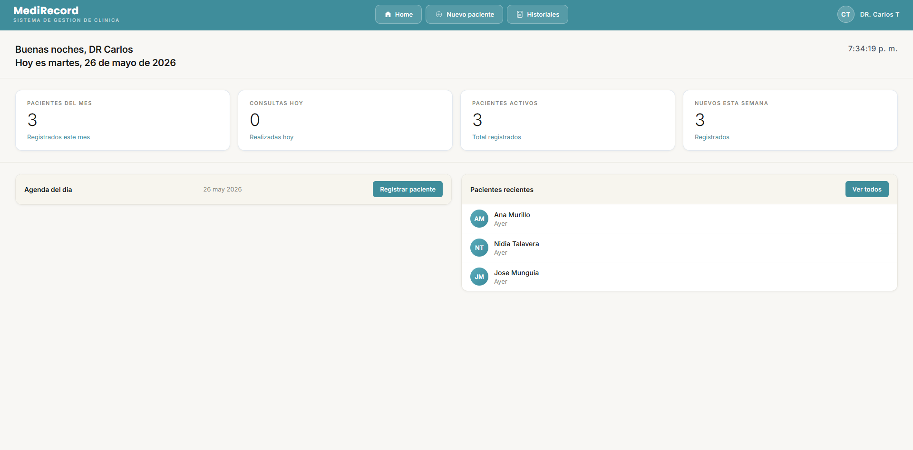
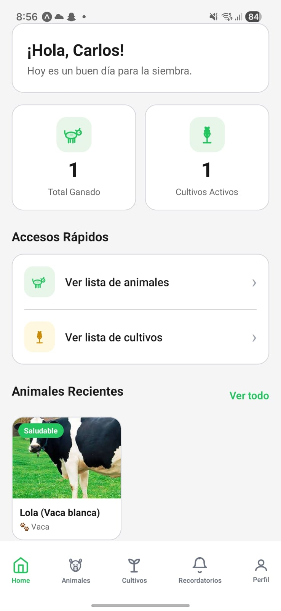

<div align="center">


<a href="https://git.io/typing-svg">
  
</a>

<br>


</div>

---

## 👨‍💻 About Me

I'm a **Systems Engineering student** passionate about software development and building practical applications.

My main interests are:

- 🌐 Web development
- ⚛️ React applications
- 🟢 Node.js & Express
- 🗄️ SQL databases
- ☕ Java & Spring Boot
- 🧹 Clean and maintainable code
- 🚀 Learning new technologies through real projects

```yaml
name: Carlos Talavera
role: Systems Engineering Student
focus:
  - Frontend Development
  - Backend Development
  - Database Design
  - Software Engineering

currently_learning:
  - TypeScript
  - Node.js
  - Express.js


motto: "Learning every day, building one project at a time."
```
## 🛠️ Tech Stack
🎨 Frontend
<p>     </p>
⚙️ Backend
<p>     </p>
🗄️ Databases
<p>     </p>
🔧 Tools
<p>     </p>

-----

## 📚 Currently Learning
<p>    </p>

I'm currently focusing on building full-stack applications with React, Node.js, Express and SQL databases.

<table> <tr> <td width="50%" valign="top"> <h3 align="center">🏥 MediRecord</h3> <div align="center"> <a href="https://github.com/Carlostala04/Gestion-pacientes">  </a>

<br><br>

<a href="https://github.com/Carlostala04/Gestion-pacientes">  </a> </div> <p> Desktop application for managing patients, medical histories and appointments for a private medical practice. </p> <p>    </p> </td> <td width="50%" valign="top"> <h3 align="center">🌱 My-Farmer</h3> <div align="center"> <a href="https://github.com/Carlostala04/My-Farmer">  </a>

<br><br>

<a href="https://github.com/Carlostala04/My-Farmer">  </a> </div> <p> Mobile application designed to help farmers manage animals, crops, parcels and reminders. </p> <p>    </p> </td> </tr> </table>
## 📊 GitHub Statistics
<div align="center">  

<br><br>

 </div>
## 📈 Contribution Graph
<div align="center">

</div>
## 📫 Contact
<div align="center"> <a href="mailto:carlostala.dev@gmail.com">  </a> <a href="https://github.com/Carlostala04">  </a> <a href="https://www.linkedin.com/in/carlos-talavera-8bb715414">  </a> <a href="https://portafolio-carlos-tala.vercel.app/">  </a> </div>
<div align="center">
## 💙 Thanks for visiting my profile!
 </div> ```
